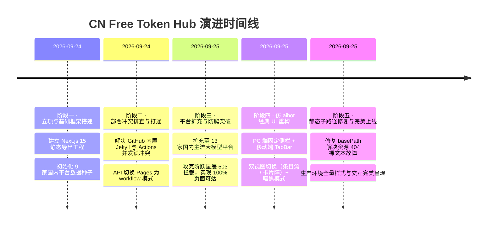

# CN Free Token Hub · 项目进度与演进记录

> **文档状态**：持续维护  
> **当前阶段**：✅ 已完成全栈重构、全自动化上线与长期自维护状态  
> **生产线上地址**：[https://nasated.github.io/cn-free-token-hub/](https://nasated.github.io/cn-free-token-hub/)

---

## 一、 项目开发演进里程碑（Milestones）

---

## 二、 各阶段攻坚详细记录

### 阶段一：项目立项与工程基建搭建
- **核心工作**：
  - 选用 Next.js 15 App Router + Tailwind CSS 搭建纯前端静态工程；
  - 确立“纯中国境内平台”、“100% API 可调用”、“不收录纯网页对话积分”三大原则；
  - 初始录入智谱 BigModel、阿里百炼、硅基流动、Kimi API、ModelScope 等 9 家平台；
  - 编写初始核验爬虫 `scripts/crawl.ts`。

### 阶段二：GitHub Actions 与 Pages 部署卡点攻坚
- **遇到的阻碍**：
  - Workflow `Daily Free-Tier Verify & Deploy` 每次构建都成功，但 `deploy-pages` 任务执行被频繁 cancelled，GitHub Pages 返回 404。
- **根本原因排查**：
  - Pages 初始化时默认使用了 `legacy`（分支构建模式），导致 GitHub 自动生成了 `dynamic/pages/pages-build-deployment` 内置 Jekyll 工作流；
  - 内置工作流与自定义工作流在 Pages 的并发部署队列中抢占互斥锁，导致任务中断。
- **彻底解决**：
  - 通过 GitHub REST API 调用 `POST /repos/nasated/cn-free-token-hub/pages`，携带 `{"build_type": "workflow"}` 参数，彻底将 Pages 构建权移交至 GitHub Actions，关闭冲突的内置构建；
  - 成功跑通端到端自动部署流水线。

### 阶段三：平台扩充与爬虫防爬穿透
- **平台扩充**：
  - 将平台数量由 9 家扩展至 **13 家**，新增：
    - **零一万物 01.AI**（Yi 系列高性价比模型）
    - **讯飞星火 Spark**（Spark Lite 永久免费无限调用）
    - **腾讯混元 Hunyuan**（开通即送 10 万 Tokens 资源包）
    - **百川智能 Baichuan**（新人体验礼包与基座大模型支持）
- **爬虫健壮性突破**：
  - **阶跃星辰 503 拦截**：将原有容易被识别为爬虫的 User-Agent 升级为现代真实 Chrome 桌面浏览器请求头，补充 `sec-ch-ua`、`Accept-Language` 等标准字段，并加入指数退避重试，阶跃星辰恢复 200 正常核验并命中关键词；
  - **百川智能 404 重定向**：将核验地址修正为稳定有效的开发者文档与计费指引页；
  - 达成 **13 / 13 平台 100% 页面连通率**（不可达数降为 0）。

### 阶段四：仿 aihot.news 经典 UI 全面重构
- **视觉风格向 aihot.news 像素级看齐**：
  - **App Shell 架构**：开发了 PC 端左侧固定侧边栏（[components/Sidebar.tsx](file:///D:/桌面/01_terminal/cn-free-token-hub/components/Sidebar.tsx)）与移动端底部快捷悬浮栏（[components/MobileTabBar.tsx](file:///D:/桌面/01_terminal/cn-free-token-hub/components/MobileTabBar.tsx)）；
  - **纸质质感配色**：浅色模式采用温润米暖白（`#faf9f6`），深色模式采用深冷炭黑（`#13191c`），辅以琥珀暖金色调；
  - **条目资讯流（Stream View）**：打造了类似 aihot 经典排版（[components/FeedItem.tsx](file:///D:/桌面/01_terminal/cn-free-token-hub/components/FeedItem.tsx)），包含序号金标（`01`、`02`、`03`）、醒目额度大字高亮、政策细节、属性胶囊与一键直达/复制链接；
  - **交互体验增强**：
    - 支持 **已读状态柔和置灰**（仿 aihot `fc-read` 体验）；
    - 支持 **⭐ 收藏常用平台**（本地存储并在“我的收藏”集中展示）；
    - 支持 **深色 / 浅色 / 跟随系统** 主题无感切换。

### 阶段五：静态子路径资源 404 排查与完美上线
- **问题现象**：
  - 用户用浏览器打开后反馈“和 aihot 根本不一样”，页面出现纯白底、纯文字堆叠、无排版样式。
- **原因定位**：
  - GitHub Pages 部署在子路径 `/cn-free-token-hub` 下，而 `next.config.mjs` 中未配置 `basePath`，导致生成的 HTML 试图从根域名 `https://nasated.github.io/_next/static/css/...` 加载样式表，全部返回 404；
- **解决验证**：
  - 在 `next.config.mjs` 中配置 `basePath: "/cn-free-token-hub"` 与 `assetPrefix`；
  - Actions 重新构建部署后，线上 CSS 资源成功加载（HTTP 200，大小 20.5 KB），页面完整恢复为高质感设计形态。

---

## 三、 当前收录平台全景图（13 家）

| # | 平台名称 | 核心免费额度 | 实名要求 | 官方直达与核验依据 |
|---|---|---|:---:|---|
| 01 | **智谱 BigModel** | 2000 万 Tokens + 图像视频包 | 否 | 支持 GLM-4-Flash 免推理费模型 |
| 02 | **阿里百炼 DashScope** | 通义各模型独立 100 万 Token | 否 | 通义千问各规格独立送额度，总量超千万 |
| 03 | **硅基流动 SiliconFlow** | 14~16 元券 + 部分模型永久免费 | 是 | Qwen2.5-7B、GLM-4-9B 等永久免费无限调用 |
| 04 | **DeepSeek** | 500 万 Tokens（新人） | 否 | 深度推理与代码大模型，直连兼容 OpenAI SDK |
| 05 | **Kimi API** | 15 元 API 代金券 | 否 | 支持 Moonshot 长上下文全系列模型 |
| 06 | **讯飞星火 Spark** | **Spark Lite 永久免费调用** | 是 | 认证开发者 Lite 版永久免费，另赠 200 万高级包 |
| 07 | **ModelScope 魔搭** | 每日免费 2000 次推理 | 否 | 官方 Serverless 免费推理，每日重置 |
| 08 | **零一万物 01.AI** | 新人体验代金券 | 是 | 支持高性价比 Yi-Lightning / Yi-Large 模型 |
| 09 | **腾讯混元 Hunyuan** | 10 万 Token（开通即送） | 是 | 腾讯云原生混元大模型 API 试用包 |
| 10 | **百川智能 Baichuan** | 新人体验礼包 | 是 | 支持 Baichuan 4 / Baichuan 3-Turbo 等基座模型 |
| 11 | **MiniMax Studio** | 新人免费体验额度 | 是 | 覆盖文本大模型与高品质语音合成（TTS）能力 |
| 12 | **阶跃星辰 StepFun** | 开发者免费试用额度 | 否 | 支持 step-1 系列 API 调试体验 |
| 13 | **CodeGeeX** | 个人版免费调用 | 否 | 代码生成与补全，无缝接入 IDE 与独立 API |

---

## 四、 后续演进路线图（Roadmap）

- [x] 搭建 Next.js 15 静态工程与自动化工作流
- [x] 解决 GitHub Pages 部署冲突与子路径样式 404 故障
- [x] 扩充至 13 家国内主流开放平台，爬虫可达率达 100%
- [x] 全面重构为仿 aihot.news 风格（侧边栏、双视图、暗黑模式、已读与收藏）
- [ ] **自定义域名接入（可选）**：支持用户随时绑定独立顶级域名（如 `*.news` / `*.cn`）
- [ ] **微信/邮件额度到期提醒（进阶）**：对活动性代金券即将过期的平台增加倒计时提醒
- [ ] **持续扩充新兴平台**：追踪百度千帆、昆仑万维等更多国内厂商的开放 API 免费策略
